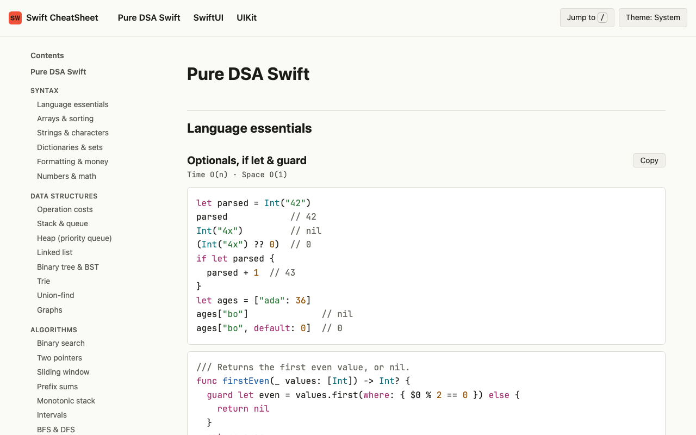
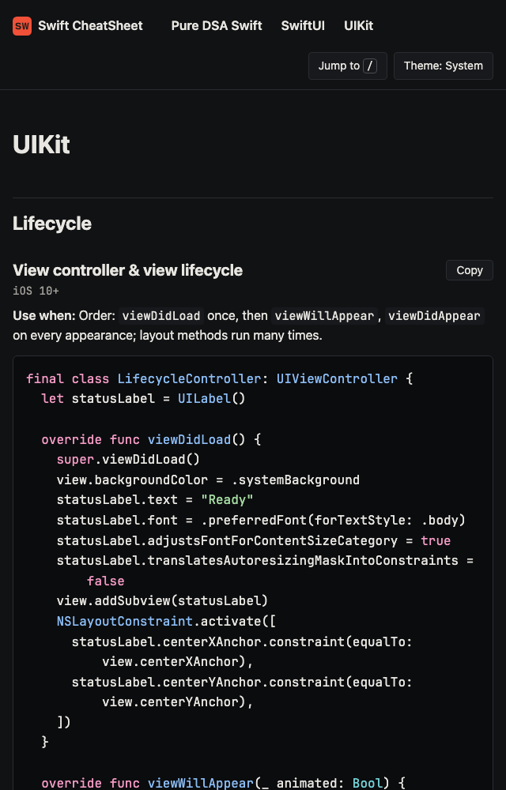
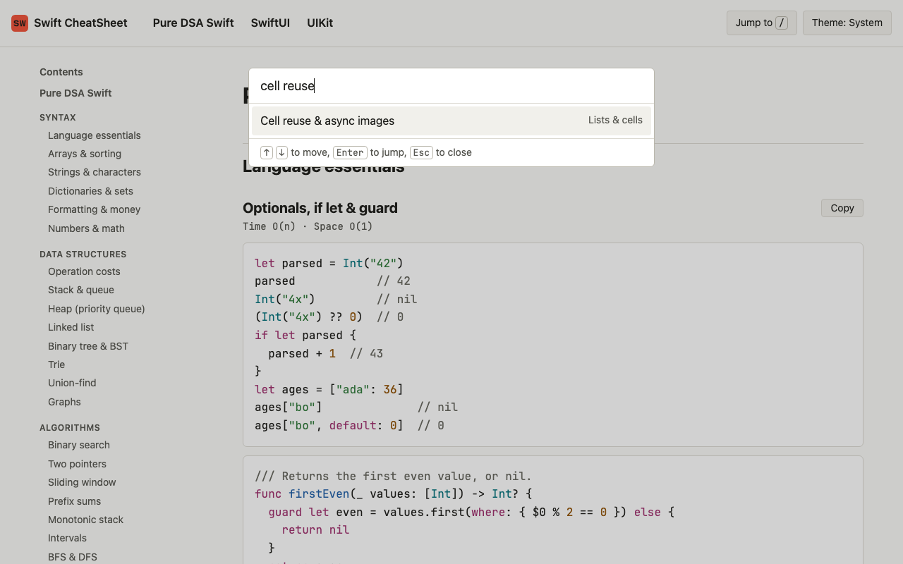

<div align="center">

# Swift CheatSheet

<kbd>
    
</kbd>

## Project Description 🎨

Swift CheatSheet is a single-page reference for iOS coding interviews: <https://arieltyson.github.io/swift-cheatsheet/>. It has five sections. **Pure DSA Swift** covers the syntax that is easy to forget under pressure (collections, strings and `String.Index`, dollars and cents with `FormatStyle`, overflow), the structures Swift does not ship (a heap, an O(1) queue and an LRU cache), protocols and generics, and tested templates for the common algorithms, from binary search to Dijkstra. **SwiftUI** and **UIKit** cover state ownership, forms, animation and gestures, loading and saving data, infinite scroll, the app lifecycle, re-renders, grids of tappable cells, navigation, layout, cell reuse, delegation and interoperability. **Architecture & data** compares MVC, MVVM and TCA, and covers dependency injection, testing with fakes, Swift Testing next to XCTest, where to store data, an image cache, pagination and mobile system design. **Concurrency & debugging** covers `URLSession` with `Codable`, modern Swift concurrency (`async let`, task groups, cancellation, actors, `@MainActor`, `@concurrent`, continuations, `AsyncStream`), callbacks with `DispatchGroup`, Combine, retain cycles, and which Xcode tool finds which bug. Every DSA result shown on the page is checked by `swift test`, every UI example is compiled against the iOS SDK in strict Swift 6 mode, and the core UI behaviours are checked on a simulator. All content is plain text on one page, so Cmd+F always works, and `/` opens a jump list.

## Screenshots:

<div style="display: flex; justify-content: center; align-items: center;">
    <kbd>
        
    </kbd>
    <kbd>
        
    </kbd>
    <kbd>
        
    </kbd>
</div>

## Technologies Used 💻

### Frameworks

- [x] **Swift 6.4, Swift 6 language mode**: every example
- [x] **Swift Testing**: runs every demo's asserts, checks each algorithm against brute force, and checks that parallel code really runs in parallel
- [x] **iOS SDK + Simulator**: strict concurrency type-checking and behaviour checks for SwiftUI and UIKit examples
- [x] **Python standard library**: a Swift lexer, highlighter and static site build
- [x] **HTML, CSS and vanilla JavaScript**: one page, no framework

### APIs & Web Services

- [x] **GitHub Pages**: static hosting
- [x] **GitHub Actions**: site tests on Linux, Swift and simulator checks on macOS, then deploy

### Data Sources

- [x] **examples/**: the tested Swift shown on the page
- [x] **content/site.toml**: sections, titles, search aliases, availability and complexity for every entry
- [x] **web/tokens.toml**: every colour, as light and dark pairs

</div>

## Architecture 🏛️

- **Pattern**: Content as code. Tested `.swift` files and a TOML manifest compile into one static HTML page
- **Results**: DSA demos keep real `assert` calls; the page shows them as `expression  // result`
- **Native validation**: `tools/native.py` type-checks all SwiftUI and UIKit examples with `-strict-concurrency=complete -warnings-as-errors`, then runs 23 checks in a temporary simulator app
- **Quality gates**: import allowlists per section, 72-column lines, WCAG contrast tests, built-page tests, a Content-Security-Policy and gzipped size budgets
- **Target**: examples need Swift 6 and iOS 17+ (each entry shows its minimum); the site needs any evergreen browser

## Features 🚀

- 🔎 **Cmd+F friendly**: every word on the page is plain text, nothing collapsed or hidden
- ⚡ **Jump list**: press `/` and type "money", "priority queue", "@State" or "cell reuse"
- 🧰 **Pure DSA Swift**: syntax, collections, formatting, a heap, and algorithm templates
- 📱 **SwiftUI**: `@State`, `@Observable`, navigation, layout, `.task(id:)`, UIKit bridges
- 🧱 **UIKit**: lifecycle, Auto Layout, diffable lists, cell reuse, delegation, presentation, hosting SwiftUI
- 🏛️ **Architecture & data**: MVVM and TCA, dependency injection, testing, persistence, caching, pagination, system design
- 🧵 **Concurrency & debugging**: tasks, task groups, actors, Combine, `DispatchGroup`, memory leaks, Xcode debugging tools
- ⏱️ **Complexity or availability on every entry**
- 📋 **Copy buttons**, 🌗 **light and dark**, 🔒 **no tracking**

## Running Locally 🛠️

```sh
python3 -m tools.build                         # writes dist/index.html
python3 -m http.server -d dist                 # open http://localhost:8000
python3 -m unittest discover -s tests/site -t .
swift test --scratch-path /tmp/swift-cheatsheet-build
python3 tools/native.py                        # needs Xcode and an iOS simulator
swift format format --in-place --recursive examples tests/swift
```

The separate scratch path keeps macOS Desktop extended attributes from breaking test bundle signing.

## Privacy 🔏

Swift CheatSheet does not use cookies, analytics or trackers. The only thing it stores is your light or dark theme choice, in your own browser. The site is hosted by GitHub Pages, which may log visitor IP addresses under the [GitHub Privacy Statement](https://docs.github.com/en/site-policy/privacy-policies/github-general-privacy-statement).

<div align="center">

## Contributing ⚙️

Add the example to `examples/`, its checks to `tests/`, and its entry to `content/site.toml`, then run the commands above. The tests fail if an example is missing from the manifest, imports outside its section, or has a line over 72 characters.

## License 🪪

This project is licensed under the MIT License. See `LICENSE` for details. JetBrains Mono is used under the SIL Open Font License 1.1 (`web/fonts/OFL.txt`).

</div>
